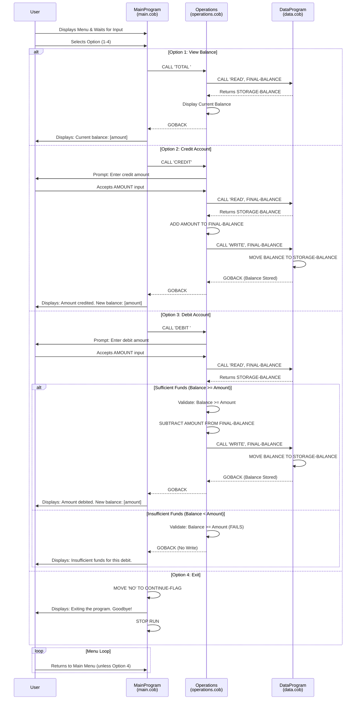

# Student Account Management System - COBOL Documentation

## Overview

This is a legacy COBOL-based Student Account Management System designed to handle basic financial operations for student accounts. The system provides a menu-driven interface for performing account balance inquiries, credit transactions, and debit transactions.

---

## System Architecture

The system is composed of three main COBOL modules that work together in a hierarchical structure:

```
MainProgram (main.cob)
    ↓
    └─→ Operations Module (operations.cob)
            ↓
            └─→ DataProgram Module (data.cob)
```

---

## COBOL Files Overview

### 1. **main.cob** - Main Program (Entry Point)
**Purpose:** Serves as the main entry point and user interface controller for the account management system.

**Key Functions:**
- Displays a menu-driven interface with four options
- Accepts user input (choices 1-4)
- Routes user requests to the Operations module via `CALL` statements
- Maintains a loop until the user chooses to exit

**Menu Options:**
1. **View Balance** - Displays current account balance
2. **Credit Account** - Adds funds to the student account
3. **Debit Account** - Withdraws funds from the student account
4. **Exit** - Terminates the program

**Business Rules:**
- Program continues running in a loop until user selects option 4 (Exit)
- Invalid choices (not 1-4) are rejected with an error message
- Control flow is managed by the `CONTINUE-FLAG` variable (default: 'YES', set to 'NO' on exit)

**Data Elements:**
- `USER-CHOICE` (PIC 9): Numeric input for menu selection (0-9)
- `CONTINUE-FLAG` (PIC X(3)): Controls main loop execution ('YES'/'NO')

---

### 2. **operations.cob** - Operations Module
**Purpose:** Handles the core business logic for account operations including balance retrieval, credit processing, and debit processing.

**Key Functions:**
- **TOTAL Operation**: Retrieves and displays current account balance
- **CREDIT Operation**: Accepts credit amount input, updates balance, and stores new balance
- **DEBIT Operation**: Accepts debit amount input, validates sufficient funds, updates balance if funds available, or displays insufficient funds message

**Business Rules:**
- **Initial Balance**: All accounts start with a default balance of 1000.00
- **Credit Transactions**: Any amount can be credited (added) to the account
- **Debit Transactions**: 
  - Only allowed if account balance >= requested debit amount
  - Prevents overdrafts or negative balances
  - Displays error message if insufficient funds
- **Communication**: Uses LINKAGE SECTION to receive operation type from MainProgram and communicate with DataProgram

**Data Elements:**
- `OPERATION-TYPE` (PIC X(6)): Type of operation ('TOTAL ', 'CREDIT', 'DEBIT ')
- `AMOUNT` (PIC 9(6)V99): Transaction amount (up to 999,999.99)
- `FINAL-BALANCE` (PIC 9(6)V99): Current account balance with 2 decimal places

**Operations Flow:**
```
TOTAL:   Read balance from Data → Display to user
CREDIT:  Read balance → Accept amount → Add amount → Write balance → Display
DEBIT:   Read balance → Accept amount → Validate funds → If OK: Subtract & Write → Display
         If insufficient: Display error message
```

---

### 3. **data.cob** - DataProgram Module
**Purpose:** Serves as the data persistence layer, managing read and write operations for the student account balance.

**Key Functions:**
- **READ Operation**: Retrieves the current stored balance from STORAGE-BALANCE
- **WRITE Operation**: Persists the updated balance to STORAGE-BALANCE

**Business Rules:**
- Acts as a simple in-memory data store for the account balance
- Balance is maintained throughout the program session (not persisted to disk)
- Uses LINKAGE SECTION to receive operation commands and exchange data with Operations module
- All balance values use format PIC 9(6)V99 (6 digits with 2 decimal places)

**Data Elements:**
- `STORAGE-BALANCE` (PIC 9(6)V99): In-memory storage for current account balance (default: 1000.00)
- `OPERATION-TYPE` (PIC X(6)): Received operation ('READ' or 'WRITE')
- `BALANCE` (PIC 9(6)V99): Passed parameter for balance exchange

**Persistence Note:** This module performs in-memory data storage only. For production systems, this would typically be replaced with database operations or file I/O.

---

## Student Account Business Rules

### Account Initialization
- Every student account begins with a default balance of **1000.00**

### Balance Inquiries
- Students can view their current account balance at any time
- No restrictions on inquiry frequency or amount

### Credit Operations
- Any amount can be credited (added) to an account
- Credits are typically used for:
  - Scholarship deposits
  - Tuition refunds
  - Financial aid disbursements
- No upper limit on credit amounts (within numeric field constraints: max 999,999.99)

### Debit Operations
- Student accounts can only be debited if sufficient funds are available
- Debit operations are typically used for:
  - Tuition charges
  - Fees
  - Campus services charges
- **Key Rule**: No overdrafts allowed - account balance cannot go below zero
- System validates funds before processing debit transactions
- If debit would result in negative balance, the transaction is rejected with "Insufficient funds" message

### Session-Based Processing
- All transactions occur in a single session
- No persistent storage between program executions
- Balance resets to 1000.00 each time the program starts

---

## Data Flow Diagram

```
┌─────────────────────────────────────────────────────────┐
│                    MainProgram                          │
│              (Menu & User Input)                        │
└────────────────────┬────────────────────────────────────┘
                     │ CALL Operations
                     │ USING Operation-Type
                     ↓
┌─────────────────────────────────────────────────────────┐
│                   Operations                            │
│           (Business Logic Processing)                  │
│  ┌──────────────────────────────────────────────────┐  │
│  │ Routes based on Operation Type:                 │  │
│  │ - TOTAL: Read & Display                         │  │
│  │ - CREDIT: Read → Add → Write & Display          │  │
│  │ - DEBIT: Read → Validate → Subtract → Write     │  │
│  └──────────────────────────────────────────────────┘  │
└────────────────────┬────────────────────────────────────┘
                     │ CALL DataProgram
                     │ USING Operation-Type, Balance
                     ↓
┌─────────────────────────────────────────────────────────┐
│                  DataProgram                            │
│           (Data Persistence Layer)                      │
│  ┌──────────────────────────────────────────────────┐  │
│  │ STORAGE-BALANCE (In-Memory Data Store)          │  │
│  │ READ Operation:  Return current balance         │  │
│  │ WRITE Operation: Store updated balance          │  │
│  └──────────────────────────────────────────────────┘  │
└─────────────────────────────────────────────────────────┘
```

---

## Field Specifications

### Numeric Field Formats
- **Balance Fields**: PIC 9(6)V99
  - Maximum value: 999,999.99
  - 6 integer digits + 2 decimal places
  - Used in all balance-related variables

- **Amount Fields**: PIC 9(6)V99
  - Same format as balance fields
  - Accepts transaction amounts up to 999,999.99

### Text Field Formats
- **Operation Type**: PIC X(6)
  - Fixed 6-character field
  - Valid values: 'TOTAL ', 'CREDIT', 'DEBIT ' (note padding with spaces)
  - Case-sensitive

- **Control Flags**: PIC X(3)
  - Used for program control ('YES' or 'NO')

---

## Error Handling

### Current Implementation
The system includes basic error handling:

1. **Invalid Menu Choice**: User receives message "Invalid choice, please select 1-4."
2. **Insufficient Funds**: Debit operation displays "Insufficient funds for this debit."

### Limitations
- No exception handling for invalid numeric input
- No validation for malformed operation types
- No logging or audit trail
- Silent failures for data consistency issues

---

## Integration Points

### Module Communication
- **MainProgram ↔ Operations**: Via CALL...USING with operation type string
- **Operations ↔ DataProgram**: Via CALL...USING with operation type and balance parameter
- **Return Mechanism**: GOBACK statement used to return control to caller

### Calling Conventions
- All modules return via GOBACK statement
- Data exchange through LINKAGE SECTION parameters
- No return codes or error indicators passed between modules

---

## Future Modernization Considerations

This system is a prime candidate for modernization due to:
1. **Legacy COBOL Code**: Difficult to maintain and enhance
2. **Limited Persistence**: In-memory only, no database integration
3. **Basic Error Handling**: No comprehensive validation or logging
4. **Monolithic Design**: Could benefit from service-oriented architecture
5. **UI/UX**: Text-based menu interface (no web/mobile support)

Recommended modern replacement technologies:
- REST API using Java/Python/Node.js
- Relational or NoSQL database for persistence
- Web/Mobile UI using modern frameworks
- Comprehensive logging and monitoring
- Unit/Integration testing frameworks

---

## Usage Instructions

### Running the Program
```bash
# Compile and run the COBOL program
cobc -x -o account_system main.cob operations.cob data.cob
./account_system
```

### Example Session
```
--------------------------------
Account Management System
1. View Balance
2. Credit Account
3. Debit Account
4. Exit
--------------------------------
Enter your choice (1-4): 1
Current balance: 1000.00

Enter your choice (1-4): 2
Enter credit amount: 500.00
Amount credited. New balance: 1500.00

Enter your choice (1-4): 3
Enter debit amount: 200.00
Amount debited. New balance: 1300.00

Enter your choice (1-4): 4
Exiting the program. Goodbye!
```

---

## Sequence Diagram - Data Flow

The following Mermaid sequence diagram illustrates the data flow through the system for the three main operations:



### Sequence Diagram Details

**Key Data Flow Patterns:**

1. **View Balance (Option 1)**
   - Simple read operation with no state changes
   - One call to DataProgram to retrieve current balance
   - Immediate display to user

2. **Credit Transaction (Option 2)**
   - Read current balance from storage
   - Accept user input for credit amount
   - Perform addition in Operations module
   - Write updated balance back to storage
   - Display confirmation with new balance

3. **Debit Transaction (Option 3)**
   - Read current balance from storage
   - Accept user input for debit amount
   - **Validation**: Check if balance >= amount
   - **If Valid**: Subtract amount and write new balance
   - **If Invalid**: Display error without writing
   - This prevents overdrafts and maintains account integrity

4. **Program Exit (Option 4)**
   - Sets control flag to exit main loop
   - Terminates program execution
   - No data persistence beyond current session

---

## Revision History

| Version | Date | Description |
|---------|------|-------------|
| 1.0 | 2026-08-15 | Initial documentation for legacy COBOL system |

---

## Contact & Support

For questions about this system, refer to the legacy COBOL codebase maintainers.
For modernization efforts, consult the architecture and development teams.
